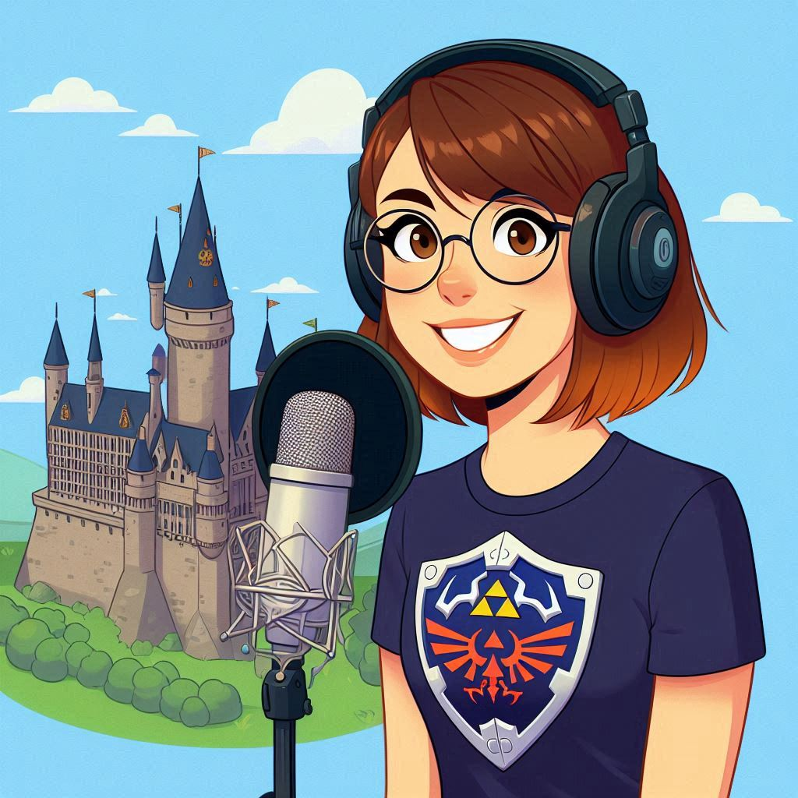

<h1 align="center">🎧🎙️ Podcast - "Castelo dos Dados" - Defenda seu reino da informação</h1>

---

## Projeto Podcast gerado por I.A.s

 > ℹ️ Repositório criado durante o curso Bootcamp Santander 2024 - Fundamentos de IA para Devs na plataforma da [DIO](https://dio.me)

Projeto com o objetivo de criar um podcast utilizando Inteligência Artificial.
Abaixo, você encontrará todos os prompts utilizados no desenvolvimento do Episódio piloto do Podcast.

<a href="https://github.com/chellegeek/create-a-podcast-IA/tree/main/output" > Clique aqui para download do Episódio Piloto</a>

## 🎧 Ouça aqui o Episódio Piloto

https://github.com/user-attachments/assets/f66f60f4-e605-491c-b489-116e649f54bb

---

## 💻 Tecnologias Utilizadas na criação do Podcast

- 🧠 [ChatGPT](https://chat.openai.com/) 
- 🎨 [Copilot](https://copilot.microsoft.com/)
- 📚 [Gemini](https://gemini.google.com/)
- 🎬 [Capcut](https://www.capcut.com/)
- 🎧 [ElevenLabs](https://elevenlabs.io/)

---
## ✅ Como foi feito ?

- Título e Roteiro gerado pelo ChatGpt e Gemini
- Audio gerado pelo ElevenLabs
- Copilot para gerar imagens
- Capcut para tratar aúdio e adicionar sons de fundo

## ⚒️ Ferramentas

- 🎨 [Prompt Imagem](https://github.com/chellegeek/create-a-podcast-IA/tree/main/prompts)
- 📄 [Prompt Título/Roteiro](https://github.com/chellegeek/create-a-podcast-IA/tree/main/prompts)
- 🎧 [Criar áudio](https://elevenlabs.io/)
- 🎬 [Editar áudio](https://www.capcut.com/)

  
## 📜 Instruções de Execução

Para criar o Podcast utilizando este projeto, utilize os prompts descrito em Ferramentas:

1. Utilize os prompts para criar a imagem de capa do Podcast no Copilot

2. Utilize os prompts para criar o título e roteiro do Podcast no ChatGPT ou Gemini.

3. Utilize os prompts de roteiro gerados pelo ChatGpt ou Gemini no ElevenLabs

4. Utilize o CapCut para editar o áudio gerado pelo ElevenLabs

5. Revise o áudio finalizado para assegurar que o conteúdo esteja claro, coeso e livre de erros.
   

✅ Essas etapas ajudarão a transformar o material gerado por IA em um Podcast super maneiro para você compartilhar.

## 👩‍💻 Aprendiz

    
    
&nbsp&nbsp&nbsp&nbspMichelle Garcia 
    &nbsp&nbsp&nbsp
    <a href="https://github.com/chellegeek">
    GitHub</a>&nbsp;|&nbsp;
   <a href="https://www.linkedin.com/in/michelle-
garcia-/">LinkedIn</a>
&nbsp;|&nbsp;
    <a href="https://www.instagram.com/chellegarciami/">
    Instagram</a>
&nbsp;|&nbsp;

  

